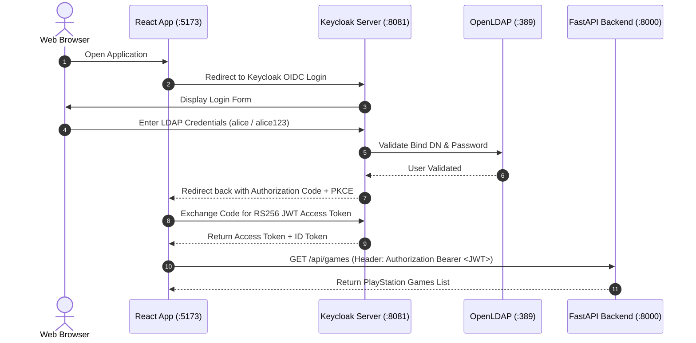

# 🎮 PlayStation Studios Dashboard - Frontend (React + OIDC / LDAP)

This repository contains the frontend web application for the **Cybersecurity Laboratory Assignment**. It is a modern, responsive single-page application (SPA) built with **React 18**, **TypeScript**, and **Tailwind CSS**, strictly integrating **`react-oidc-context`** and **`oidc-client-ts`** for centralized OpenID Connect (OIDC) authentication backed by **Keycloak** and **OpenLDAP**.

---

## 📋 Table of Contents
- [Project Overview](#project-overview)
- [Architecture & Layered Design](#architecture--layered-design)
- [Key Features](#key-features)
- [Technologies Used](#technologies-used)
- [Authentication & Security Flow](#authentication--security-flow)
- [API Integration & JWT Logging](#api-integration--jwt-logging)
- [Getting Started](#getting-started)
- [Test Credentials](#test-credentials)

---

## 🎯 Project Overview

The project provides a dashboard showcasing games developed by **PlayStation Studios** (such as *God of War Ragnarök*, *Spider-Man 2*, *The Last of Us Part II*, and *Ghost of Tsushima*).

Users must authenticate via Keycloak OIDC, which federates identity management with an OpenLDAP database. Once authenticated, the application obtains an **RS256-signed JWT access token**, which is attached as a `Bearer Token` to every outgoing API request to the FastAPI backend.

---

## 🏗️ Architecture & Layered Design

The codebase strictly adheres to a clean layered architecture inside `src/`:

```
frontend/src/
├── config/
│   └── authConfig.ts          # Keycloak OIDC client configuration (oidc-client-ts)
├── services/
│   └── api.ts                 # Axios HTTP client with Bearer Token interceptor & JWT console logging
├── types/
│   └── index.ts               # TypeScript interfaces for Game, UserProfile, and JwtLogEntry
├── components/
│   ├── Navbar.tsx             # Header bar displaying LDAP user identity & navigation
│   ├── GameCard.tsx           # PlayStation game card component
│   ├── AddGameModal.tsx       # Modal dialog for creating new games with quick presets
│   └── JwtLoggerViewer.tsx    # Live JWT drawer console inspecting request logs & claims
└── pages/
    ├── LoginPage.tsx          # OIDC login landing screen with Keycloak redirect
    ├── DashboardPage.tsx      # Main dashboard displaying games catalog & add game trigger
    └── TokenInspectorPage.tsx # Secondary page for deep JWT decoding & claims inspection
```

---

## ✨ Key Features

1. **Keycloak LDAP Authentication:** Seamless PKCE authorization code grant redirect flow using `react-oidc-context`.
2. **PlayStation Games Dashboard:** Displays games with ratings, genre tags, platforms, studios, and release years.
3. **Interactive Modal Dialog:** Allows users to insert new games into the backend SQLite database with quick preset templates.
4. **Console JWT Logging:** Every outgoing HTTP request prints a detailed `console.log` containing the injected Bearer Token as required by the rubric.
5. **Secondary OIDC Page (JWT Inspector):** A dedicated page showcasing decoded LDAP claims (`preferred_username`, `email`, `sub`, `iss`, `aud`), session expiration countdown timers, RS256 algorithm validation, and server verification testing (`GET /api/profile`).
6. **Docker Multi-Stage Build:** Containerized using Node 20 alpine build stage and lightweight production Nginx server.

---

## 🛠️ Technologies Used

- **Framework:** React 18 (Vite + TypeScript)
- **OIDC / OAuth2 Libraries:** `react-oidc-context` (^3.2.0) & `oidc-client-ts` (^3.1.0)
- **Styling:** Tailwind CSS (Clean Light PlayStation Design System)
- **HTTP Client:** Axios with Interceptors & `jwt-decode`
- **Icons:** Lucide React
- **Containerization:** Docker & Nginx

---

## 🔐 Authentication & Security Flow



---

## 📡 API Integration & JWT Logging

Every request sent to the FastAPI backend is automatically intercepted by `src/services/api.ts`:

```typescript
// Example snippet from src/services/api.ts
client.interceptors.request.use((config) => {
  if (accessToken) {
    config.headers.Authorization = `Bearer ${accessToken}`;
    console.log(`[OIDC JWT LOG] API_REQUEST: ${config.method?.toUpperCase()} ${config.url}`, {
      token: accessToken
    });
  }
  return config;
});
```

---

## 🚀 Getting Started

### Local Development

1. Install dependencies:
   ```bash
   npm install
   ```

2. Run development server:
   ```bash
   npm run dev
   ```

3. Open browser at `http://localhost:5173`.

### Docker Container Run

To build and run the frontend container standalone:

```bash
docker build -t playstation-dashboard-frontend .
docker run -p 5173:80 playstation-dashboard-frontend
```

---

## 🔑 Test LDAP Credentials

| Username | Password | Federation Source |
| :--- | :--- | :--- |
| `alice` | `alice123` | OpenLDAP (`ou=users,dc=example,dc=com`) |
| `bob` | `bob123` | OpenLDAP (`ou=users,dc=example,dc=com`) |

---

## 📦 GitHub Repositories

This project is part of a 3-repository solution:
1. **LDAP + Keycloak Docker Stack:** [https://github.com/BlackBoxUwU/ldap-keycloak-oauth2-lab](https://github.com/BlackBoxUwU/ldap-keycloak-oauth2-lab)
2. **FastAPI Backend:** [https://github.com/BlackBoxUwU/fastapi-backend-ldap-oauth](https://github.com/BlackBoxUwU/fastapi-backend-ldap-oauth)
3. **React Frontend:** [https://github.com/BlackBoxUwU/react-playstation-dashboard-ldap-oauth](https://github.com/BlackBoxUwU/react-playstation-dashboard-ldap-oauth)
